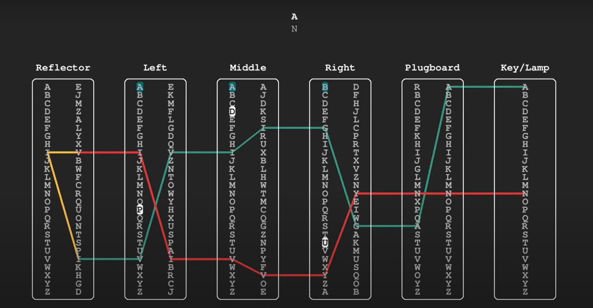

# ENIGMA MACHINE

<b>The Enigma machine</b> is a complex encryption machine used by the germans in the 2nd World War to encode messages. It is made up of several components:

`1. Plugboard : a physical board that swaps between certain letters.`

`2. Reflector : a physical board that swaps letters 2 by 2.` \
For example, if A is connected to D, then D -> (reflector) -> A and
A -> (reflector) -> D.

`3. Rotor : a mechanical wheel which contains a permutation of the 26 letters
of the alphabet, and a notch whose role is to rotate the wheel from the left.` \
Exemplu : For Rotor1 we have \
A B C D E F G H I J K L M N O P Q R S T U V W X Y Z \
E K M F L G D Q V Z N T O W Y H X U S P A I B R C J, \
with notch on Q.

We want to build the logic behind the enigma machine to be able to encrypt
and decrypt messages.
The machine configuration is stored in a config[10][26] matrix as follows:

- lines 0 - 1 represent the configuration of the first rotor.
- lines 2 - 3 represent the configuration of the second rotor.
- lines 4 - 5 represent the configuration of the third rotor.
- lines 6 - 7 represent the configuration of the reflector.
- lines 8 - 9 represent the configuration of the plugboard.

## Place the rotors in the initial position:

We will implement the following function: \
`void rotate_x_positions(int x, int rotor, char config[10][26], int forward)` \
where:

`x - the offset of the new position`

`rotor - the rotor on which the rotation is applied (indexing is done from 0!)`

`config - the configuration of the machine that you will have to modify`

`forward - direction of rotation` (if forward = 0 then it shifts to the left
x positions, if forward = 1 then it shifts to the right x positions).

The config matrix will be modified according to the rotor parameter.

Example: \
If the first two lines from the config matrix contains the configuration of the first rotor, for example \
A B C D E F G H I J K L M N O P Q R S T U V W X Y Z \
E K M F L G D Q V Z N T O W Y H X U S P A I B R C J \
and we apply the function: \
rotate_x_positions(3, 0, config, 0), then these two lines will be modified in \
D E F G H I J K L M N O P Q R S T U V W X Y Z A B C \
F L G D Q V Z N T O W Y H X U S P A I B R C J E K M

## Message encryption:

We will implement the following function: \
`void enigma(char *plain, char key[3], char notches[3], char config[10][26], char *enc)` \
where:

`plain - the text to be encrypted`

`key - the initial positions of the rotors (key[i] = the initial position of the rotor i)`

`notches - the initial notches of the rotors (notches[i] = the initial notch of the rotor i)`

`config - machine configuration`

`enc - the address to which we will write the encrypted text`

Attention: before reading the character from the plain, the 3rd rotor must be turned
with 1 position (left shift) and its initial position increased (alphabet
is circular, so if we increase Z it becomes A). If the current position
BEFORE ROTATING the rotor is equal to its notch, then we will also rotate
the rotor on its left with 1 position (this will be done for every
rotors less the first);

Example 1 : key = "QWE", notches = "AAE" => key = "QXF"

Example 2 : key = "QWE", notches = "AWE" => key = "RXF"

## Example of character encryption:



## How to use it

First, you will have to compile everything with:

```
    make
```

(if you want to see the make rules, open the <b>Makefile</b>)

The <b><i>input/</i></b> folder will contain examples of configurations to play with. In order to view the encrypted / decrypted message, you have to use:

```
    ./checker
```

If you can't use it, make sure ./checker has permissions to execute:

```
    chmod +x ./checker
```

After you use the ./checker, in the <b><i>output/</i></b> folder will be stored the results of each example in the <b><i>input/</i></b> folder.

If you want to modify an example, make sure you use <b>make</b> first and then <b><i>./checker</i></b>, to compile and execute every modification.
